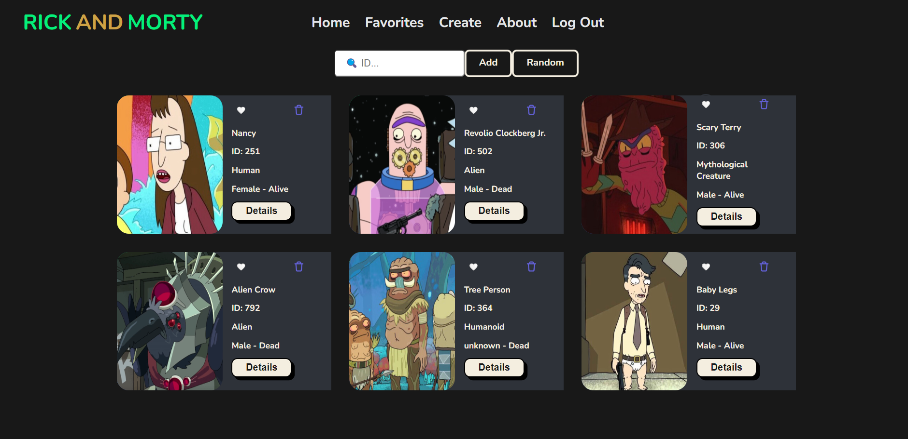

# Rick and Morty

### Code implementation of Rick and Morty Personal Project

A basic web to call [rick and morty API](https://rickandmortyapi.com/)  and display cards with each character information.

There is also an option to create a card an the image is created with DALL·E 2 from OpenAI.
* currently not working correctly.

#### Preview of the Project

